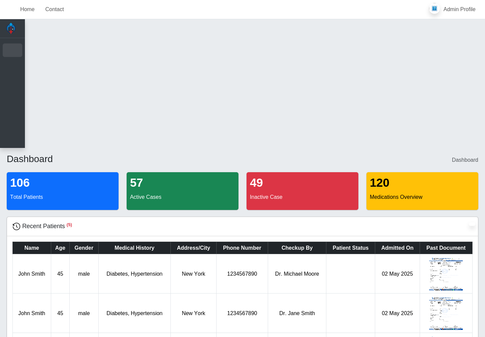
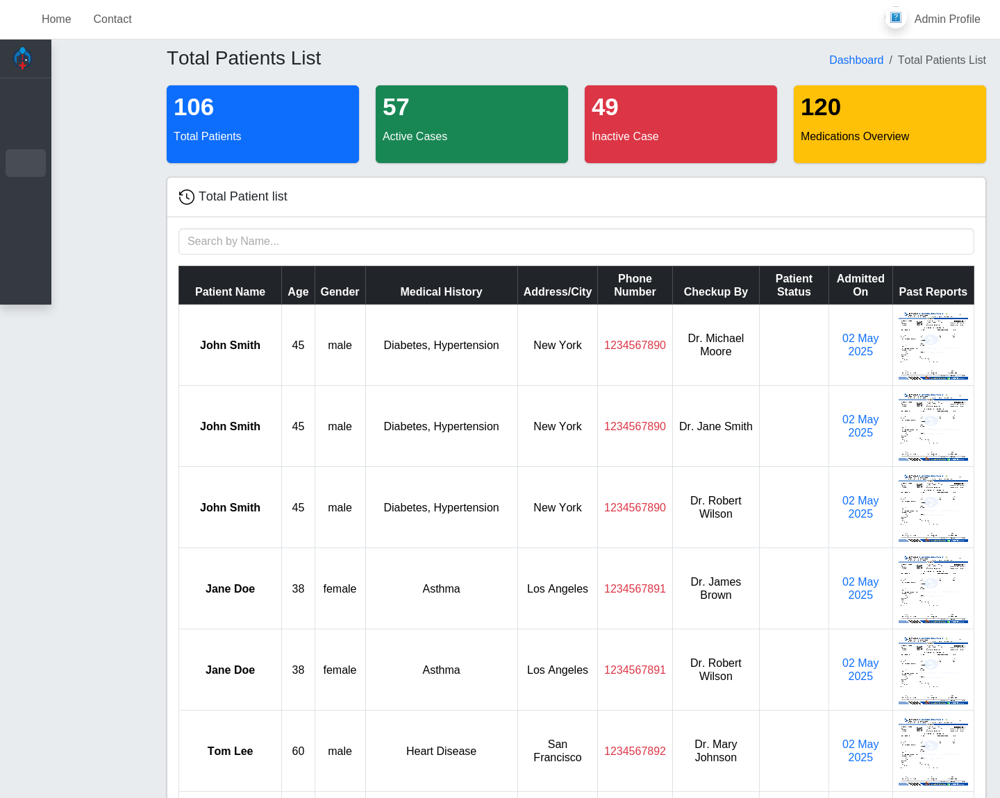
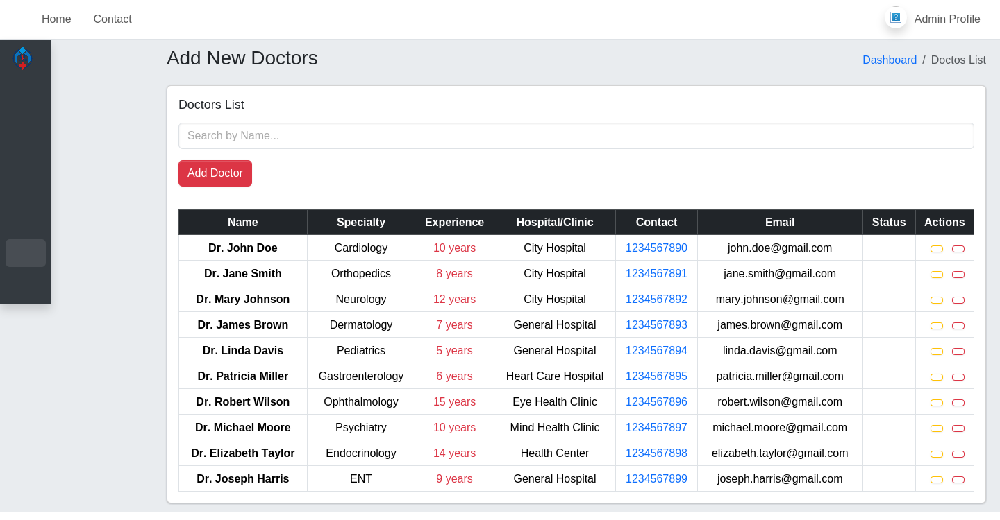
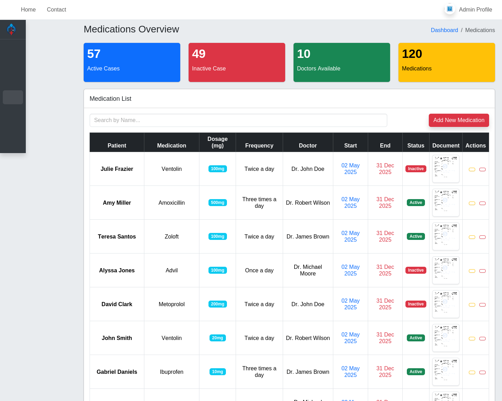
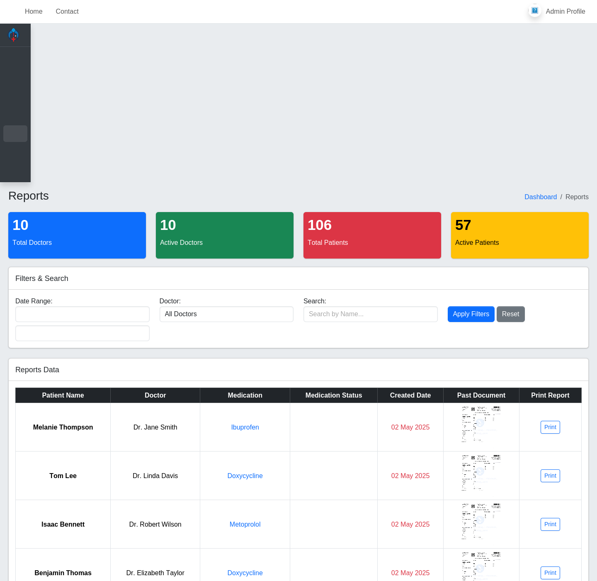
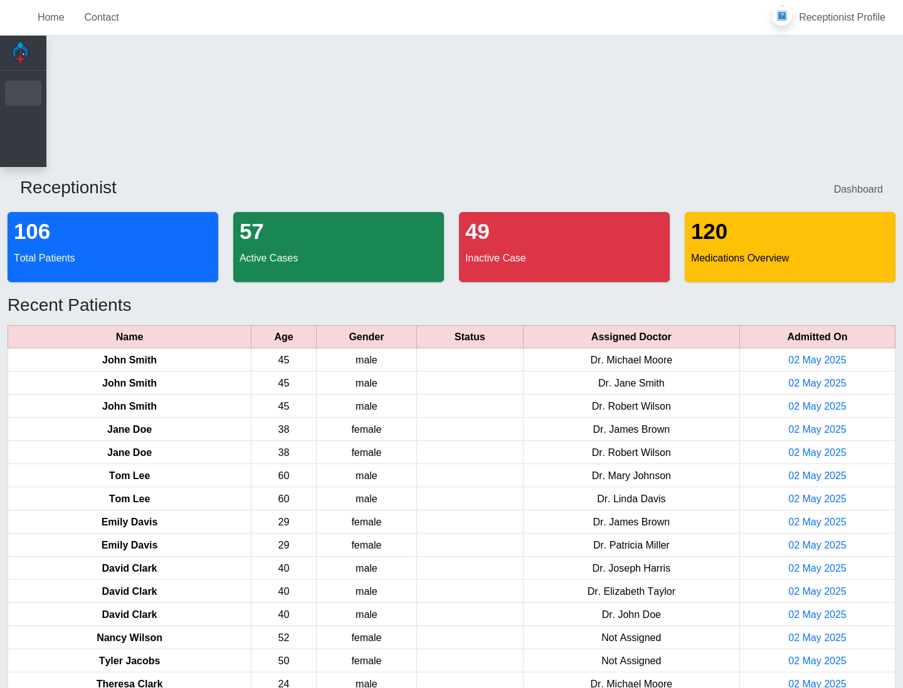
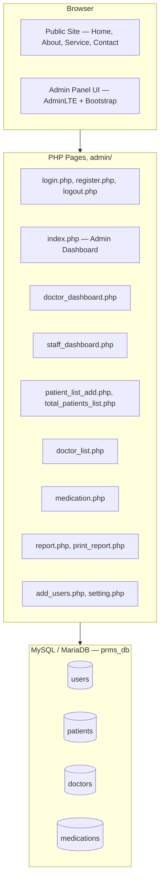
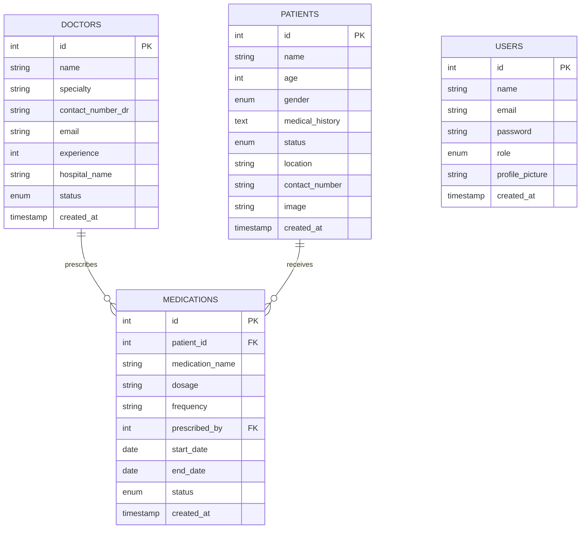
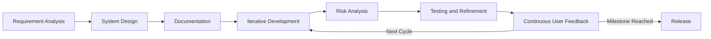

<div align="center">

# 🏥 PRMS
### Patient Record Management System

**A centralized web platform for managing patient records, doctors, and medications**


</div>

---

## Table of Contents

- [About the Project](#about-the-project)
- [Screenshots](#screenshots)
- [Key Features](#key-features)
- [System Architecture](#system-architecture)
- [System Users and Roles](#system-users-and-roles)
- [Core Functionalities](#core-functionalities)
- [Data Model](#data-model)
- [Project Structure](#project-structure)
- [Design Goals and Non-Functional Requirements](#design-goals-and-non-functional-requirements)
- [Security and Hardening Notes](#security-and-hardening-notes)
- [Development Methodology](#development-methodology)
- [Getting Started](#getting-started)
- [Roadmap](#roadmap)
- [Built With and Credits](#built-with-and-credits)
- [Acknowledgments](#acknowledgments)
- [Contributing](#contributing)
- [Project Information](#project-information)
- [License and Disclaimer](#license-and-disclaimer)

---

## About the Project

**PRMS (Patient Record Management System)** is a web-based healthcare records platform built with plain PHP and MySQL. It gives a small clinic or hospital one place to manage patient demographics and medical history, a directory of doctors, prescribed medications, and printable reports — with three staff roles (Admin, Doctor, Receptionist) each landing on a dashboard scoped to what they need.

The project has two parts:

- A **public-facing informational site** — Home, About, Service, and Contact pages that any visitor can browse
- A **role-protected admin panel**, built on the AdminLTE dashboard framework, where staff actually manage records

### Why It Matters

- Replaces scattered paper charts and spreadsheets with a searchable, centralized system
- Gives every staff role a dashboard scoped to what they actually need to see
- Keeps medications tied directly to a patient *and* a prescribing doctor, not a loose text note
- Produces printable, patient-specific reports on demand

### Project Objectives

*From the original project brief:*

- 📂 Maintain accurate and up-to-date patient records
- ⚡ Improve hospital operational efficiency
- 🔒 Ensure secure storage of sensitive medical data
- 📊 Enable health trend analysis
- 🌱 Promote a paperless healthcare environment
- 📈 Support research through structured data

---

## Screenshots

*Captured from a local run of the actual application.*

### 🖥️ Admin Dashboard
A snapshot of the whole system at a glance — total patients, active/inactive cases, and total medications, plus a live feed of recently added patients.



### 🗂️ Patient Records
Search and browse the full patient list, with medical history, contact details, the doctor who checked them in, and a link to each patient's past report.



### 🧑‍⚕️ Doctor Directory
Add, edit, and manage the roster of doctors available in the system, including specialty, years of experience, and hospital affiliation.



### 💊 Medication Management
Every prescription is tied to a patient and a doctor, with dosage, frequency, start/end dates, and status tracked in one table.



### 📊 Reports and Analytics
Filter by date range, doctor, or patient name, then print an individual patient report directly from the browser.



### 🧾 Receptionist Dashboard
A role-scoped view built for front-desk work — patient counts and a recent-patients feed showing each patient's assigned doctor.



### 🔐 Login
A clean, focused entry point into the admin panel.


### 🌐 Public Landing Page
A public-facing informational front end sits in front of the admin panel — a home page plus about, service, and contact pages, built on a free hospital-website template (see [Built With and Credits](#built-with-and-credits)).


---

## Key Features

| | | |
|---|---|---|
| 🔐 Role-based dashboards (Admin, Doctor, Receptionist) | 🗂️ Centralized, searchable patient records | 🧑‍⚕️ Doctor directory with full CRUD |
| 💊 Medication tracking linked to patient and doctor | 📊 Filterable reports with per-patient printing | 👤 Staff account administration |
| 🖼️ Profile pictures and patient photos | 🌐 Public-facing informational site | ⚙️ Personal settings and password management |

---

## System Architecture

PRMS is a classic server-rendered PHP application. Each page under `admin/` handles its own request, queries MySQL directly through `mysqli`, and renders HTML using shared header, navbar, and sidebar includes. There's no separate API layer or front-end framework — the browser talks directly to PHP, and PHP talks directly to the database.



---

## System Users and Roles

Three roles can sign in, each landing on a different dashboard after login:

| Role | Lands On | Typical Tasks |
|---|---|---|
| ⚙️ Admin | `index.php` — full Dashboard | Manage patients, doctors, medications, reports, staff accounts, and settings |
| 🧑‍⚕️ Doctor | `doctor_dashboard.php` | View the doctor roster |
| 🧾 Receptionist | `staff_dashboard.php` | View patient counts and the recent-patients feed |

Patients themselves don't have login accounts — they're records that staff create and maintain, not system users.

### Permission Matrix

Reflects what each dashboard is designed to show. See [Security and Hardening Notes](#security-and-hardening-notes) for how consistently this is enforced at the page level today.

| Capability | Admin | Doctor | Receptionist |
|---|:---:|:---:|:---:|
| View own dashboard | ✅ | ✅ | ✅ |
| Manage patient records | ✅ | – | – |
| Manage doctor directory | ✅ | – | – |
| Manage medications | ✅ | – | – |
| View reports / print patient report | ✅ | – | – |
| Manage staff accounts | ✅ | – | – |
| Edit own profile / password | ✅ | ✅ | ✅ |

---

## Core Functionalities

### 🔐 Authentication and Session Management
Registration, login, logout, and role-based redirects, backed by PHP sessions.
- Register a new Doctor or Receptionist account (Admin accounts are seeded directly in the database)
- Log in with email and password; each role is redirected to its own dashboard
- Update name, email, password, and profile picture from Settings

### 🗂️ Patient Records Management
One record per patient, searchable from the admin panel.
- Add, view, and update patient records
- Store demographics (name, age, gender, location, contact number), a free-text medical history field, and a profile photo
- Track patient status (active / inactive)
- Search patients by name

### 🧑‍⚕️ Doctor Directory
A managed roster of doctors available to the clinic.
- Add, edit, and remove doctors
- Track specialty, years of experience, hospital affiliation, contact details, and active/inactive status
- Search the directory by name

### 💊 Medication Management
Prescriptions are their own table, linked to both a patient and a prescribing doctor.
- Assign a medication to a patient, with dosage, frequency, and start/end dates
- Track medication status (active / inactive)
- Foreign keys tie each medication to a `patients` row and a `doctors` row, so records stay consistent if either changes

### 📊 Reports and Analytics
- Filter records by date range, doctor, or patient name
- View patient distribution by status and location
- Generate and print a report for an individual patient

### ⚙️ Administration
- Create, edit, and remove staff accounts (Admin, Doctor, Receptionist)
- Assign roles to new accounts

---

## Data Model

Four tables make up `prms_db`. `medications` is the only table with formal foreign keys — it ties each prescription to both a patient and a doctor.



`users` and `doctors` are intentionally separate tables — a doctor's login account and their directory listing aren't linked by a foreign key today. Keep that in mind if you extend the schema (see [Roadmap](#roadmap)).

---

## Project Structure

```text
PRMS/
├── admin/                        # Role-protected admin panel
│   ├── Include/                  # Shared header, navbar, sidebar, footer
│   ├── assets/                   # AdminLTE theme images and icons
│   ├── css/, js/                 # AdminLTE v4.0.0-beta3 (bundled)
│   ├── uploads/                  # Patient / doctor / profile photos
│   ├── config.php                # Database connection
│   ├── login.php / register.php / logout.php
│   ├── index.php                 # Admin dashboard
│   ├── doctor_dashboard.php      # Doctor dashboard
│   ├── staff_dashboard.php       # Receptionist dashboard
│   ├── patient_list_add.php      # Add / update patients
│   ├── total_patients_list.php   # Patient list + search
│   ├── doctor_list.php           # Doctor directory (CRUD)
│   ├── medication.php            # Medication management
│   ├── report.php                # Reports and filters
│   ├── print_report.php          # Printable per-patient report
│   ├── add_users.php             # Staff account administration
│   └── setting.php               # Personal profile settings
├── Database File/
│   └── prms_db.sql               # Full schema + seed data
├── css/, js/, scss/               # Public site styling
├── img/                            # Public site imagery
├── lib/                             # OwlCarousel, Tempus Dominus, Waypoints
├── index.html                       # Public landing page
├── about.html / service.html / contact.html
└── Readme.md
```

---

## Design Goals and Non-Functional Requirements

Targets set out in the original project brief:

| Category | Target |
|---|---|
| ⚡ Performance | 2–3 second response time; support for concurrent users |
| 🛡️ Security | AES-256 encryption, TLS 1.3, role-based access control, audit logging |
| ⏳ Reliability | 99.9% uptime; backup and recovery |
| 🌍 Compatibility | Chrome, Firefox, Edge, Safari; HL7 and FHIR standards |
| 📈 Scalability | Load balancing; cloud and on-premise deployment |
| ♿ Usability | WCAG 2.1 accessibility; multilingual support |

See the next section for where the current build stands against the security targets specifically.

---

## Security and Hardening Notes

A few things worth tightening up before this goes anywhere near real patient data:

- **Password hashing.** `login.php` and `register.php` currently hash passwords with `md5()`. MD5 is fast and unsalted, which makes it a poor fit for passwords. Switching to PHP's built-in `password_hash()` / `password_verify()` (bcrypt by default) is a small, contained change with a big security payoff.
- **Query style.** Most CRUD pages (`add_users.php`, `doctor_list.php`, parts of `setting.php`) already use prepared statements via `mysqli::prepare()`. `login.php`, `register.php`, and a couple of others still interpolate `$_POST` values directly into the SQL string, which opens the door to SQL injection. Bringing everything in line with the prepared-statement pattern already used elsewhere would close that gap.
- **Page-level access control.** The three dashboards (`index.php`, `doctor_dashboard.php`, `staff_dashboard.php`) and `setting.php` check `$_SESSION` before rendering. The feature pages they link to (`patient_list_add.php`, `total_patients_list.php`, `doctor_list.php`, `medication.php`, `report.php`, `print_report.php`, `add_users.php`) don't currently repeat that check, so they rely on the user having come from a dashboard rather than enforcing it directly on the page. Adding the same session guard used in `index.php` to each of those files would make access control hold regardless of how a page is reached.

None of this is unusual for a project at this stage — it's exactly the kind of list a code review would produce, and each item has a well-understood, contained fix.

---

## Development Methodology

PRMS is developed using the **VU Process Model**, a hybrid approach that pairs the structure of the Waterfall model with the flexibility of the Spiral model.

**Waterfall phases** provide a stable foundation — requirement analysis, system design, and documentation. **Spiral phases** then iterate on top of that foundation — iterative development, risk analysis, testing and refinement, and continuous user feedback.



This hybrid approach means the project starts with solid, well-documented requirements and design, then refines the implementation through repeated cycles of building, testing, and incorporating feedback.

---

## Getting Started

### Prerequisites
- PHP 7.4 or later (built and tested on PHP 8.0)
- MySQL 5.7+ or MariaDB 10.4+
- Any local PHP environment — XAMPP, WAMP, MAMP, or PHP's own built-in server

### 1. Clone the repository
```bash
git clone https://github.com/<your-username>/PRMS.git
cd PRMS
```

### 2. Create the database
Create a database named `prms_db`, then import the provided schema:
```bash
mysql -u root -p prms_db < "Database File/prms_db.sql"
```
(Or import `Database File/prms_db.sql` through phpMyAdmin.)

> **Note:** `Database File/` is currently listed in `.gitignore`, so the SQL file won't come through on a fresh `git clone`. Share it separately with anyone setting the project up, or remove that line from `.gitignore` if you want it tracked.

### 3. Configure the database connection
`admin/config.php` connects to MySQL with these defaults:
```php
$servername = "localhost";
$username   = "root";
$password   = "";
$dbname     = "prms_db";
```
Update these to match your environment.

### 4. Run it
```bash
php -S localhost:8000
```
- Public site: `http://localhost:8000/index.html`
- Admin login: `http://localhost:8000/admin/login.php`

### Demo Accounts
The seed data includes one account per role:

| Role | Email |
|---|---|
| Admin | admin@gmail.com |
| Doctor | doc@gmail.com |
| Receptionist | rec@gmail.com |

Passwords are hashed in the seed data — reset one directly in the database, or register a new account from the Register page.

---

## Roadmap

Features described in the original project scope that aren't in the current build yet:

- 📅 Appointment scheduling (request, schedule, reschedule, cancel)
- 💳 Billing and payment processing
- 🩺 Structured clinical notes, separate from the free-text medical history field
- 📜 A dedicated audit log table, beyond PHP's own error log
- 🌐 HL7 / FHIR interoperability
- ♿ A WCAG 2.1 accessibility pass and multilingual support
- 🤖 AI-based health trend prediction, a mobile app, and telemedicine integration — longer-term ideas from the original brief

---

## Built With and Credits

- **[AdminLTE v4.0.0-beta3](https://adminlte.io/)** — the admin dashboard UI framework behind the entire `/admin` panel
- **Bootstrap 5.3.3** and **Font Awesome 6.7.2** — loaded via CDN on the login and registration pages
- **Medinova hospital website template** — the public-facing Home / About / Service / Contact pages are built on this free template
- **OwlCarousel**, **Tempus Dominus**, and **Waypoints.js** — supporting front-end libraries bundled in `lib/`

---

## Acknowledgments

- **Dr. Syed Shah Muhammad**, project supervisor, for guidance throughout the design and development process
- **Virtual University of Pakistan**, for the academic framework this project was developed under

---

## Contributing

This project is developed as academic coursework. If you're a team member, please follow a standard Git workflow:

1. Create a feature branch from `main`
2. Commit changes with clear, descriptive messages
3. Open a pull request for review before merging

---

## Project Information

| | |
|---|---|
| **Project Name** | Patient Record Management System (PRMS) |
| **Version** | 1.0 |
| **Group ID** | F24PROJECT258FD |
| **Supervisor** | Dr. Syed Shah Muhammad |
| **Institution** | Virtual University of Pakistan |

---

## License and Disclaimer

This project is developed for **academic purposes** as part of university coursework.

> ⚠️ PRMS is a learning project and is not certified for real-world clinical use. Deploying it with real patient data would require the hardening steps listed in [Security and Hardening Notes](#security-and-hardening-notes) at minimum, plus a full compliance review against applicable healthcare data protection regulations (such as HIPAA or GDPR, depending on jurisdiction) in addition to the HL7/FHIR standards targeted in the original scope.
